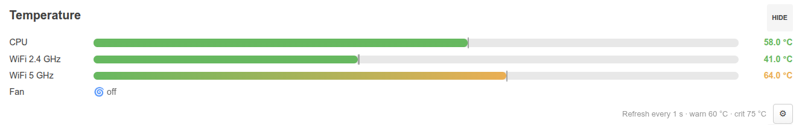

# luci-app-temp

Temperature widget for the LuCI **Status → Overview** page.



*BananaPi BPI-R3: CPU + mt7915 WiFi radios (5 GHz above the 60 °C warning
threshold — orange) + fan state; refresh interval set to 1 s via the ⚙ modal.*

Target platform: **OpenWrt 25.x** (modern JS-based LuCI, `apk`). Developed and
tested on OpenWrt 25.12 / LuCI 26.x on:

- **BananaPi BPI-R3** (MT7986) — CPU + mt7915 WiFi 2.4/5 GHz radios + fan PWM
- **BananaPi BPI-R4 Lite** (MT7987) — CPU only (no WiFi hwmon / no fan on board);
  the widget degrades gracefully to whatever sensors the board exposes

## Features

- CPU/SoC temperature from `/sys/class/thermal/thermal_zone*`
- Any hwmon `temp*_input` sensors (e.g. mt7915/mt7986 WiFi radios); hwmon
  devices that mirror a thermal zone are deduplicated automatically
- Fan: real RPM from hwmon `fan*_input` when a tachometer exists; otherwise the
  **thermal cooling-device level** (`off` / `level N/M`). Raw PWM duty is used
  only as a last resort — on some boards (BPI-R3) the PWM wiring is inverted
  (`cooling-levels = <255 40 0>`), so raw `pwm1` would read backwards
- Colored gradient bars (green → orange → red by thresholds) with a
  session-peak marker per sensor
- Own refresh poll, independent of the page-wide LuCI poll — **interval is
  configurable from the UI** (default 5 s)
- ⚙ settings modal: refresh interval + warning/critical thresholds, stored in
  UCI (`/etc/config/luci_temp`), applied on the fly without page reload

## Project structure

| File | Purpose |
|---|---|
| `htdocs/luci-static/resources/view/status/include/28_temp.js` | Overview widget (frontend) |
| `root/usr/libexec/rpcd/luci.temp` | rpcd plugin: ubus object `luci.temp`, method `getData` |
| `root/usr/share/rpcd/acl.d/luci-app-temp.json` | ACL: read `luci.temp`, read/write UCI `luci_temp` |
| `root/etc/config/luci_temp` | UCI config: `poll_interval`, `warn_temp`, `crit_temp` |
| `Makefile` | luci.mk package Makefile (for OpenWrt SDK builds) |

## Installation

No compilation is needed — everything is interpreted (shell + JS). Copy four
files to the router:

```sh
ROUTER=root@192.168.1.1

scp htdocs/luci-static/resources/view/status/include/28_temp.js \
    $ROUTER:/www/luci-static/resources/view/status/include/
scp root/usr/libexec/rpcd/luci.temp $ROUTER:/usr/libexec/rpcd/
scp root/usr/share/rpcd/acl.d/luci-app-temp.json $ROUTER:/usr/share/rpcd/acl.d/
scp root/etc/config/luci_temp $ROUTER:/etc/config/

ssh $ROUTER 'chmod 755 /usr/libexec/rpcd/luci.temp && /etc/init.d/rpcd restart'
```

Verify the backend:

```sh
ssh $ROUTER 'ubus call luci.temp getData'
```

Expected output — a JSON object with `sensors` (millidegrees) and `fans`
(rpm and/or pwm) arrays.

Then open **Status → Overview** in LuCI and hard-reload the page
(Ctrl+Shift+R) to bypass the browser cache. A new **Temperature** section
appears between *Storage* and *Ports*.

### Surviving sysupgrade

Files outside `/etc/config/` are lost on sysupgrade — add them to
`/etc/sysupgrade.conf`:

```
/www/luci-static/resources/view/status/include/28_temp.js
/usr/libexec/rpcd/luci.temp
/usr/share/rpcd/acl.d/luci-app-temp.json
```

(`/etc/config/luci_temp` is preserved automatically.)

### Uninstall

```sh
ssh $ROUTER 'rm -f /www/luci-static/resources/view/status/include/28_temp.js \
    /usr/libexec/rpcd/luci.temp /usr/share/rpcd/acl.d/luci-app-temp.json \
    /etc/config/luci_temp && /etc/init.d/rpcd restart'
```

(and remove the three lines from `/etc/sysupgrade.conf`).

## SDK build (optional)

Drop this directory into `feeds/luci/applications/` (or `package/`) of an
OpenWrt buildroot/SDK and build `luci-app-temp` as usual.

## Configuration

`/etc/config/luci_temp`:

```
config settings 'settings'
	option poll_interval '5'    # refresh interval, seconds (1..3600)
	option warn_temp '60'       # orange threshold, °C
	option crit_temp '75'       # red threshold, °C
```

Editable from the UI via the ⚙ button in the widget; manual `uci` edits are
picked up on the next page load.

## How it works

The Overview page (`view/status/index.js`) auto-discovers all
`view/status/include/NN_*.js` files and polls them at the global LuCI poll
interval. This widget instead registers its **own** poll
(`poll.add(fn, interval)`) with the interval from UCI, keeps a persistent DOM
node and mutates it in place — so its refresh rate is independent of the
page-wide poll. The `load()` hook does real work only once; subsequent global
ticks are no-ops.

The rpcd backend is a plain shell script (jshn) executed on demand — no
daemon, no polling on the router side.

## License

[MIT](LICENSE). See [CHANGELOG.md](CHANGELOG.md) for release history.
